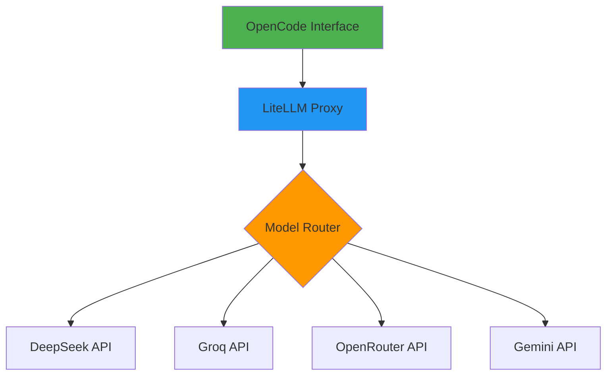

# 🚀 LLM Cluster Proxy: LiteLLM + OpenCode


**Uma solução de cluster de modelos de linguagem com failover automático e transparência total de modelos.**

---

## 📋 Visão Geral

Este repositório documenta a configuração de um **Cluster de Modelos de Linguagem (LLM) resiliente** que utiliza o **LiteLLM** como servidor proxy para gerenciar múltiplos provedores e o **OpenCode** como interface de desenvolvimento. A arquitetura garante **Failover Automático** e **Transparência de Modelos**, permitindo trocar entre diferentes LLMs instantaneamente sem alterar o código do projeto.

### ✨ Principais Funcionalidades

- ✅ **Failover Automático**: Alternância transparente entre modelos em caso de falha
- ✅ **Multi-provedor**: Suporte a DeepSeek, Groq, OpenRouter, Gemini e outros
- ✅ **Endpoint Único**: Interface unificada para todos os modelos
- ✅ **Transparência Total**: Visibilidade completa sobre qual modelo está sendo usado
- ✅ **Alta Disponibilidade**: Configuração com systemd para recuperação automática
- ✅ **Logs Detalhados**: Monitoramento completo do cluster

---

## 🏗️ Arquitetura



O sistema funciona como um **middleware local** que unifica diferentes APIs de LLM sob um único endpoint (`http://localhost:4000/v1`). Isso permite:

1. **Abstração de Provedores**: Troque entre modelos sem alterar o código
2. **Balanceamento de Carga**: Distribuição inteligente entre modelos disponíveis
3. **Resiliência**: Recuperação automática em caso de falhas
4. **Monitoramento**: Logs detalhados para troubleshooting

---

## 📦 Pré-requisitos

| Componente | Versão | Instalação |
|------------|--------|------------|
| **Python** | 3.10+ | `sudo apt install python3.10` |
| **LiteLLM** | Latest | `pip install litellm` |
| **OpenCode** | Latest | [Instalação Oficial](https://opencode.ai) |

---

## 🔧 Configuração Passo a Passo

### 1️⃣ Configuração do Proxy (LiteLLM)

Crie o arquivo de configuração `~/litellm-config.yaml`:

```yaml
# ~/litellm-config.yaml
model_list:
  - model_name: cluster-osint
    litellm_params:
      model: gemini/gemini-2.0-flash-lite
      api_key: "os.environ/GEMINI_API_KEY"
      max_tokens: 8192

  - model_name: cluster-osint
    litellm_params:
      model: groq/llama-3.3-70b-versatile
      api_key: "os.environ/GROQ_API_KEY"
      max_tokens: 4096

  - model_name: cluster-osint
    litellm_params:
      model: openrouter/qwen/qwen-2.5-72b-instruct
      api_key: "os.environ/OPENROUTER_API_KEY"
      max_tokens: 4096

  - model_name: cluster-osint
    litellm_params:
      model: deepseek/deepseek-chat
      api_key: "os.environ/DEEPSEEK_API_KEY"
      api_base: https://api.deepseek.com
      max_tokens: 4096
      drop_invalid_params: true

router_settings:
  routing_strategy: simple-shuffle
  enable_fallbacks: true
```

**Notas Importantes:**
- `drop_invalid_params: true` é essencial para compatibilidade com DeepSeek
- `max_tokens` deve estar entre 1 e 8192 para evitar erros 400
- As chaves API são carregadas das variáveis de ambiente

### 2️⃣ Configuração da Interface (OpenCode)

Ajuste o arquivo `~/.config/opencode/opencode.json`:

```json
{
  "$schema": "https://opencode.ai/config.json",
  "model": "litellm/cluster-osint",
  "provider": {
    "litellm": {
      "npm": "@ai-sdk/openai-compatible",
      "name": "LiteLLM-Proxy",
      "options": {
        "baseURL": "http://localhost:4000/v1"
      },
      "models": {
        "cluster-osint": { 
          "name": "Cluster Economia (Gemini > Groq > DeepSeek)", 
          "limit": { 
            "context": 32768, 
            "output": 4096 
          } 
        }
      }
    }
  }
}
```

**⚠️ Atenção:** O OpenCode exige que `context` e `output` sejam definidos como números inteiros dentro do objeto `limit`.

### 3️⃣ Automação com Systemd (Linux)

Para inicialização automática e recuperação de falhas:

#### Criar o Serviço Systemd

```bash
sudo nano /etc/systemd/system/litellm.service
```

Adicione o seguinte conteúdo (substitua `USUARIO` pelo seu nome de usuário):

```ini
[Unit]
Description=LiteLLM Proxy Service
After=network.target
Wants=network.target

[Service]
Type=simple
User=USUARIO
WorkingDirectory=/home/USUARIO
Environment="PATH=/home/USUARIO/.local/bin:/usr/local/bin:/usr/bin:/bin"
ExecStart=/home/USUARIO/.local/bin/litellm \
  --config /home/USUARIO/litellm-config.yaml \
  --port 4000 \
  --drop_params \
  --debug
Restart=always
RestartSec=5
StandardOutput=append:/home/USUARIO/litellm.log
StandardError=append:/home/USUARIO/litellm.log

# Limite de recursos (opcional)
MemoryLimit=512M
CPUQuota=50%

[Install]
WantedBy=multi-user.target
```

#### Ativar e Iniciar o Serviço

```bash
# Recarregar systemd
sudo systemctl daemon-reload

# Habilitar inicialização automática
sudo systemctl enable litellm

# Iniciar o serviço
sudo systemctl start litellm

# Verificar status
sudo systemctl status litellm

# Verificar logs em tempo real
sudo journalctl -u litellm -f
```

---

## 🚀 Inicialização Rápida

Para testar rapidamente sem systemd:

```bash
# 1. Exportar variáveis de ambiente
export DEEPSEEK_API_KEY="sua-chave-aqui"
export GROQ_API_KEY="sua-chave-aqui"
export OPENROUTER_API_KEY="sua-chave-aqui"
export GEMINI_API_KEY="sua-chave-aqui"

# 2. Iniciar o proxy LiteLLM
litellm --config ~/litellm-config.yaml --port 4000 --drop_params

# 3. Testar o endpoint
curl http://localhost:4000/v1/models
```

---

## 🔍 Troubleshooting

### Problemas Comuns e Soluções

| Problema | Sintoma | Solução |
|----------|---------|---------|
| **Erro 400** | `Invalid max_tokens` | Defina `max_tokens` entre 1 e 8192 no `litellm-config.yaml` |
| **Configuração Inválida** | OpenCode rejeita JSON | Certifique-se que `context` e `output` são números inteiros |
| **Proxy Não Inicia** | Porta 4000 em uso | Use `--port 4001` ou libere a porta: `sudo fuser -k 4000/tcp` |
| **Falha de Autenticação** | Erro 401/403 | Verifique se as variáveis de ambiente estão configuradas corretamente |
| **Alta Latência** | Respostas lentas | Verifique a conexão de rede ou troque de provedor |

### Comandos Úteis para Monitoramento

```bash
# Verificar logs em tempo real
tail -f ~/litellm.log

# Monitorar uso de recursos
sudo systemctl status litellm

# Verificar portas abertas
sudo netstat -tlnp | grep 4000

# Testar conectividade do proxy
curl -v http://localhost:4000/v1/health

# Reiniciar serviço
sudo systemctl restart litellm

# Verificar métricas do sistema
htop
```

### Logs Detalhados

Os logs são armazenados em `~/litellm.log` e incluem:

- **Timestamp**: Data e hora de cada requisição
- **Modelo Usado**: Qual LLM processou a requisição
- **Tempo de Resposta**: Latência de cada chamada
- **Status Codes**: Códigos HTTP de retorno
- **Erros Detalhados**: Stack traces completos para debugging

---

## 📊 Modelos Suportados

| Modelo | Provedor | Contexto | Saída | Observações |
|--------|----------|----------|-------|-------------|
| **DeepSeek Chat** | DeepSeek | 65K | 4K | Requer `drop_invalid_params: true` |
| **Llama 3.3 70B** | Groq | 32K | 4K | Alta velocidade de inferência |
| **Qwen 2.5 72B** | OpenRouter | 32K | 4K | Excelente para código |
| **Gemini 2.0 Flash** | Google | 128K | 8K | Maior contexto disponível |

---

## 🔄 Estratégias de Roteamento

O LiteLLM oferece várias estratégias de roteamento:

1. **`simple-shuffle`** (Padrão): Alterna aleatoriamente entre modelos disponíveis
2. **`usage-based`**: Roteia com base no uso histórico
3. **`latency-based`**: Seleciona o modelo com menor latência
4. **`least-busy`**: Escolhe o modelo com menos requisições ativas

Para alterar a estratégia, modifique `routing_strategy` no `litellm-config.yaml`.

---

## 🛡️ Segurança

### Melhores Práticas

1. **Variáveis de Ambiente**: Nunca armazene chaves API em arquivos de configuração
2. **Firewall**: Restrinja o acesso à porta 4000 apenas para localhost
3. **Logs Sensíveis**: Configure permissões adequadas para arquivos de log
4. **Updates**: Mantenha todas as dependências atualizadas

```bash
# Configurar firewall (UFW)
sudo ufw allow from 127.0.0.1 to any port 4000
sudo ufw deny 4000

# Proteger arquivos de configuração
chmod 600 ~/litellm-config.yaml
chmod 600 ~/.config/opencode/opencode.json
```

---

## 🤝 Contribuição

Contribuições são bem-vindas! Siga estes passos:

1. Fork o repositório
2. Crie uma branch para sua feature (`git checkout -b feature/AmazingFeature`)
3. Commit suas mudanças (`git commit -m 'Add some AmazingFeature'`)
4. Push para a branch (`git push origin feature/AmazingFeature`)
5. Abra um Pull Request

### Padrões de Código

- Use Python 3.10+ com type hints
- Documente todas as funções públicas
- Inclua exemplos de uso
- Mantenha a compatibilidade com versões anteriores

---

**⭐ Se este projeto foi útil para você, considere dar uma estrela no GitHub!**

---

*Última atualização: Março 2026 | Mantido por [Michel Vittoria](https://github.com/michelvittoria)*
